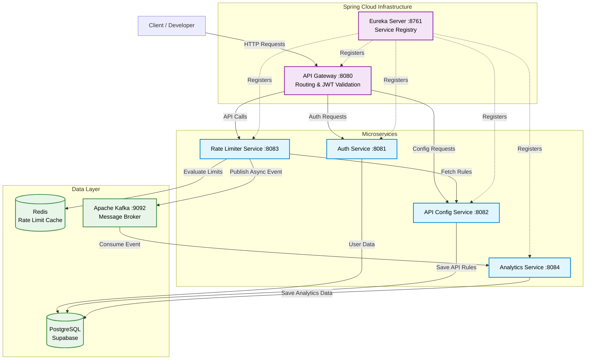

# Scalable API Rate Limiter Platform


A robust, highly scalable microservices-based API Rate Limiter platform built using **Spring Boot**. This platform allows developers to register, define rate limiting configurations for their APIs using various algorithms, and view real-time analytics of their API usage. It utilizes **Redis** for fast, low-latency rate limit evaluation and **Apache Kafka** for asynchronous, high-throughput analytics processing.

---

## Key Features

* **Developer Authentication:** Secure registration and login leveraging JWT.
* **Multiple Rate Limiting Algorithms:** Comprehensive support for various use cases:
  * **Fixed Window:** Simple and effective for standard limits.
  * **Sliding Window:** Smooths out traffic spikes.
  * **Leaky Bucket:** Ensures a constant rate of output.
  * **Token Bucket:** Allows for bursts of traffic while maintaining a steady average.
* **Dynamic API Configuration:** Developers can configure and update rate limit rules per API endpoint dynamically without downtime.
* **Real-time Analytics:** Asynchronously processes request logs via Kafka and stores them in PostgreSQL for detailed reporting and monitoring.
* **Microservices Architecture:** Built with Spring Cloud, incorporating an API Gateway for routing and a Eureka Service Registry for dynamic service discovery.

---

## Architecture

The platform is designed with a distributed microservices architecture to ensure high availability and scalability.



### Core Components

1. **API Gateway (`api-gateway`):** The single entry point for all incoming requests. It handles JWT validation and routes traffic to the appropriate backend microservices.
2. **Auth Service (`auth-service`):** Manages developer registration, authentication, and JWT token issuance.
3. **API Config Service (`api-config-service`):** Provides APIs for developers to create, update, delete, and manage rate limit rules tailored to their specific endpoints.
4. **Rate Limiter Service (`rate-limiter-service`):** The core engine that evaluates incoming requests against the configured rules using Redis. It supports multiple algorithms and publishes request evaluation events to Kafka for analytics.
5. **Analytics Service (`analytics-service`):** A consumer service that listens to Kafka topics, processing request events and storing them in PostgreSQL to generate usage reports.
6. **Eureka Server (`eureka-server`):** The Netflix Eureka service registry enabling dynamic discovery of all platform microservices.

---

## Technology Stack

* **Language & Framework:** Java 17, Spring Boot 3.5.x
* **Cloud & Routing:** Spring Cloud Gateway, Netflix Eureka
* **Database:** PostgreSQL (via Supabase)
* **Caching & Rate Limiting Engine:** Redis 7.2
* **Message Broker:** Apache Kafka 7.5.0 & Zookeeper
* **Infrastructure & Containerization:** Docker, Docker Compose

---

## Getting Started

Follow these instructions to get a copy of the project up and running on your local machine.

### Prerequisites

* [Java 17](https://adoptium.net/)
* [Maven](https://maven.apache.org/)
* [Docker](https://www.docker.com/) & Docker Compose

### 1. Start Infrastructure (Redis, Kafka, Zookeeper)

Run the provided `docker-compose.yml` to spin up the required infrastructure components in the background:

```bash
docker-compose up -d
```

* **Redis** will be available on port `6379`.
* **Kafka** will be available on port `9092`.
* **Kafka UI** (for managing Kafka topics) will be available on port `8090` (accessible at `http://localhost:8090`).

### 2. Configure Database

By default, the services are configured to connect to a **Supabase PostgreSQL** instance.
To run locally, you must update the `application.properties` file in the following services:
* `auth-service`
* `api-config-service`
* `rate-limiter-service`
* `analytics-service`

Update the `spring.datasource.url`, `username`, and `password` with your PostgreSQL credentials.

### 3. Start the Microservices

The microservices must be started in a specific order to ensure proper registration and discovery.

| Order | Service | Port | Description |
|---|---|---|---|
| 1 | **Eureka Server** (`eureka-server`) | `8761` | Service Registry |
| 2 | **Auth Service** (`auth-service`) | `8081` | Authentication & User Management |
| 3 | **API Config Service** (`api-config-service`) | `8082` | Rate Limit Rule Management |
| 4 | **Rate Limiter Service** (`rate-limiter-service`) | `8083` | Rate Limit Evaluation Engine |
| 5 | **Analytics Service** (`analytics-service`) | `8084` | Async Analytics Processor |
| 6 | **API Gateway** (`api-gateway`) | `8080` | Entry point & Router |

You can start each service using the Maven wrapper from its respective folder:

```bash
cd <service-folder>
./mvnw spring-boot:run
```

---

## Typical API Flow

1. **Register/Login:** A developer authenticates via the Auth Service and receives a JWT token.
2. **Configure API:** The developer uses the API Config Service to establish a rate-limit configuration for their endpoint (e.g., *100 requests per minute using the Token Bucket algorithm*).
3. **Send Request:** The client application sends a request through the API Gateway, including the JWT in the Authorization header.
4. **Evaluate Limit:** The Rate Limiter Service consults Redis to evaluate the request against the developer's rules.
   * If allowed, the request is forwarded/processed.
   * If the limit is exceeded, a `429 Too Many Requests` response is returned.
5. **Analytics Generation:** Regardless of the outcome (Allowed or Blocked), an event is published to Kafka. The Analytics Service consumes this event and stores it in the database for dashboarding and reporting.

---

## License

This project is licensed under the MIT License.
